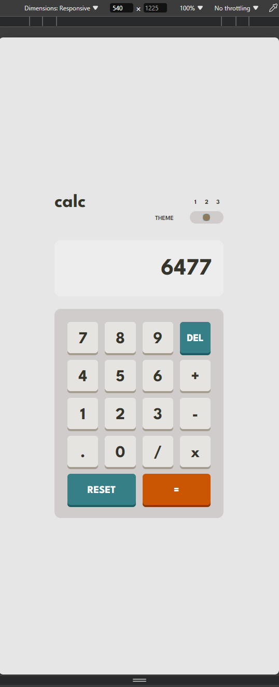

# Frontend Mentor - Calculator app solution

This is my solution to the [Calculator app challenge on Frontend Mentor](https://www.frontendmentor.io/challenges/calculator-app-9lteq5N29).
Frontend Mentor challenges help you improve your coding skills by building realistic projects.

## Table of contents

- [Overview](#overview)
    - [Issues I've encountered](#issues-ive-encountered)
    - [Screenshot #1](#screenshot-1)
    - [Screenshot #2](#screenshot-2)
    - [Screenshot #3](#screenshot-3)
    - [Screenshot #4](#screenshot-4)
    - [Links](#links)
- [My process](#my-process)
    - [Built with](#built-with)
    - [What I learned](#what-i-have-learnt)

## Overview

The calculator app is one of the most common pet projects you could start coding with, but this one actually has difference compared to classic calculator app
since it gives you detailed design concept you need to deal with.

### Issues I've encountered

Well, there is many of them. Since I'm still kinda new for web development, I had to face many issues: many different array manipulations, loops, replacing
css :hover element and many-many more. I overcame pretty much all of them for now. I could still comeback to remake something though. For example, make this
as an actual app with nodeJS ;)

### Screenshot #1

### Screenshot #2

### Screenshot #3

### Screenshot #4

### Links

- [Solution URL]()
- [Live Site URL](https://petyabiszeps.github.io/calculator-app/)

## My process

During this challenge I've used only vanilla instruments. I also reconsidered many 'algorithms' I have used in previous projects since this is the biggest
(in therms of style) project I've done on FrontendMentor, at least at the moment.

### Built with

As I already said, I've used only vanilla instruments:

* HTML
* CSS
* JavaScript

### What I have learnt

Well, basically I've and still learning to work with vanilla web development instruments and to create balance between them. I found some new (for me) JS
functionality, methods, etc. Also, I had practice with JS loops, arrays and css grid. It's always good to have some practice ;)